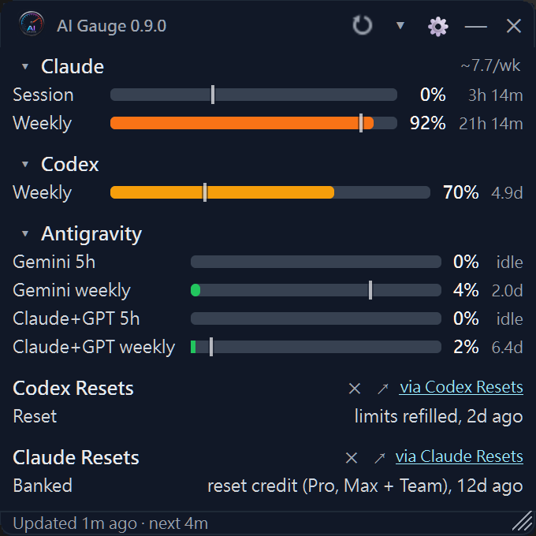

<p align="center">
  
</p>

<h1 align="center">AI Gauge</h1>

<p align="center"><strong>AI 用量，一目了然。</strong></p>

<p align="center">
  <a href="README.md">English</a> · <a href="README.zh-TW.md">繁體中文</a> · <strong>简体中文</strong>
</p>

<p align="center">
  <a href="https://github.com/DraftingDreamer/ai-gauge/actions/workflows/test.yml"></a>
  
  
  
</p>

这是 [John Pajak 的 AI Gauge](https://github.com/jpajak/ai-gauge) 的 **DraftingDreamer 分支版本（fork）**，维护于 [DraftingDreamer/ai-gauge](https://github.com/DraftingDreamer/ai-gauge)。本分支保留了上游项目的 MIT 许可证和源码出处声明。此处仅概述分支特有的新增功能；上游项目的原有功能和历史，请参阅[上游项目](https://github.com/jpajak/ai-gauge)。

| 分支新增功能 | 作用 |
| --- | --- |
| Antigravity 额度 | 读取本地 `agy /quota` 的输出，支持选择可执行文件，以及 Gemini／Claude+GPT 显示分组；当某次响应可能已消耗 token 时，会停止轮询。 |
| 重置公告 | 新增 Codex Resets 和 Claude Resets 磁贴；Windows 上使用并发的原生 Toast 通知，并以系统托盘气泡通知作为兜底。 |
| 刷新状态 | 错误标签会显示原因，并将保留的数值标记为过期（stale）。 |
| Codex 概览 | 从概览页面读取当前额度（支持英文和繁体中文界面），包含每周重置倒计时，并拒绝将 Analytics 历史数据误判为当前额度。 |
| Claude 登录 | 检测到可识别的登录重定向时，显示“Sign in”操作；部分内容基于 [innoscoutpro](https://github.com/innoscoutpro/ai-gauge/commits?author=innoscoutpro) 的改动。 |

AI Gauge 是一款小巧的桌面监控工具，支持 **Claude.ai**、**ChatGPT Codex**、
**Antigravity**、**OpenCode Go**、**GitHub Copilot** 和 **OpenRouter**，
让你一眼掌握用量上限、重置时间、余额和花费。还可以选择开启本地
统计，估算本机上 Claude Code 和 Codex 活动按 API 计价的等价费用。

- **Windows / Linux** — 始终置顶、可拖动的无边框小组件，外加系统托盘图标。
- **macOS** — 类似 Stats 的菜单栏项（`● Cl 42% ● Cx 78% ● Co 15%`）；点击后，面板会以弹出窗口（popover）的形式打开。

> **需要 Python 3.11 及以上版本。** 机密信息存放在操作系统原生的凭据存储中（Windows 凭据管理器／DPAPI、macOS 钥匙串、Linux Secret Service）。开机自启动采用各平台的标准机制（Windows 任务计划程序／LaunchAgent／`~/.config/autostart`）。

当前版本：**0.9.0**。发行说明请见 [CHANGELOG.md](CHANGELOG.md)。

AI Gauge 是独立的开源项目，属于非官方的本地桌面小工具，与 Anthropic、OpenAI、GitHub、Microsoft、OpenRouter 或任何其他服务提供商均无关联。各提供商的页面和 API 可能随时变更，恕不另行通知。

## 截图

**DraftingDreamer 分支 0.9.0 — Windows**

<p align="center">
  
</p>

截取自运行中的 Windows 发行版。用量数值为截图时的状态。

**上游界面示例 — Windows / Linux** — 始终置顶的悬浮小组件，分为完整和紧凑模式：

<p align="center">
  
  &nbsp;&nbsp;
  
</p>

**上游界面示例 — macOS** — 原生菜单栏用量摘要：

<p align="center">
  
</p>

## 下载

每个版本的预构建二进制文件都发布在 [DraftingDreamer Releases 页面](https://github.com/DraftingDreamer/ai-gauge/releases)。请选择对应你操作系统的压缩包，解压后即可运行：

| 操作系统 | 压缩包                               | 运行方式                           |
| ------- | ------------------------------------ | ---------------------------------- |
| Windows | `ai-gauge-<version>-windows.zip`     | 解压后运行 `ai-gauge.exe`          |
| macOS   | `ai-gauge-<version>-macos.tar.gz`    | 解压后，将 `ai-gauge.app` 拖到“应用程序”文件夹 |
| Linux   | `ai-gauge-<version>-linux.tar.gz`    | 解压后运行 `./ai-gauge/ai-gauge`   |

每个压缩包旁都附有 SHA256 校验值。构建产物未经签名，关于 SmartScreen／Gatekeeper 的处理方法，请参阅下方[首次启动警告](#构建独立可执行文件)一节。

## 从源码运行

**Windows（PowerShell）：**

```powershell
py -m venv .venv
.\.venv\Scripts\python.exe -m pip install -e .
.\.venv\Scripts\python.exe -m aigauge
```

**macOS / Linux（bash）：**

```bash
python3 -m venv .venv
./.venv/bin/python -m pip install -e .
./.venv/bin/python -m aigauge
```

首次启动时，小组件会显示已启用的提供商磁贴。Claude 和 Codex 使用 **Sign in**（登录）或 **Paste cookie**（粘贴 Cookie）流程；OpenCode Go、GitHub Copilot 和 OpenRouter 则需在“设置”中使用 API 凭据进行配置。你可以打开“设置”禁用不使用的提供商，或添加更多 Claude、Codex 或 OpenCode Go 账号。

## 各提供商的首次设置

| 提供商             | 设置方式 |
| ------------------ | -------- |
| **Claude.ai**      | **Sign in（推荐）：** 会询问要使用哪一个已安装的 Chrome 系浏览器并记住你的选择，支持 Google 和通行密钥（passkey），并自动接入获取到的 Claude 会话，无需复制 Cookie。**Paste cookie：** 仍保留作为恢复用的兜底方式。如需添加其他 Claude 订阅，请前往 **设置 → Claude**。 |
| **ChatGPT Codex**  | 与 Claude 相同 — **Sign in** 会使用你选择的已安装浏览器，并自动接入 ChatGPT 会话，包括关联 Google 和使用通行密钥的账号。**Paste cookie** 仅作为兜底。如需添加其他 Codex 订阅，请前往 **设置 → Codex**。 |
| **OpenCode Go**    | 前往 <https://opencode.ai/auth> 登录并复制 API 密钥。在 **设置 → OpenCode** 中，将密钥粘贴到订阅名称旁边。每个订阅都有独立的密钥和磁贴。AI Gauge 会将密钥存放在系统凭据存储中，并通过已认证的 Go API 读取 Rolling、Weekly 和 Monthly 用量。应用内使用较短的名称 **OpenCode**。 |
| **GitHub Copilot** | 前往 <https://github.com/settings/personal-access-tokens/new> 创建 **fine-grained PAT**（细粒度个人访问令牌）。个人方案请添加 **Account permissions → Plan → Read**。将其粘贴到“设置”中，并设置你每月的 AI 积分额度（Pro=1,500、Pro+=7,000、Max=20,000）。如果 Copilot 通过组织计费，请填写计费组织，并使用具有组织计费访问权限的令牌／账号，以及 **Organization permissions → Administration → Read**。 |
| **OpenRouter**     | 前往 <https://openrouter.ai/keys> 创建推理（inference）API 密钥，并粘贴到“设置”中。若要显示账户余额和模型活动，另请前往 <https://openrouter.ai/settings/provisioning-keys> 创建管理密钥（management key）。管理密钥无法用于推理；AI Gauge 会将其单独存储，且仅用于 OpenRouter 的管理端点。每日花费预算为可选项。 |
| **Antigravity**    | 在 **设置 → General** 中启用 **Antigravity**。AI Gauge 会运行本地 `agy` CLI 的 `/quota` 命令；无需在 AI Gauge 中输入账号或 API 密钥。**agy CLI** 一栏留空即可自动检测（先找 `PATH` 中的 `agy`，Windows 上再找 `%LOCALAPPDATA%\agy\bin\agy.exe`），你也可以自行选择可执行文件。如果文件不存在，或文件名不是 `agy`，系统会报告错误且不会运行。磁贴可显示 Gemini 和 Claude+GPT 的用量，各有 5 小时和每周上限；请在 Antigravity 标签页中选择要显示的分组。AI Gauge 在自行调用 `agy` 时会禁用其后台更新并隐藏其控制台窗口；这不会影响你自己运行 `agy` 时的更新。如果响应表明有 token 消耗，或结果无法确认未消耗，轮询会停止，直到重启 AI Gauge。 |

### 多个 Claude / Codex / OpenCode Go 账号

Claude、Codex 和 OpenCode Go 都可以同时跟踪多个订阅。打开该提供商的“设置”标签页，点击 **Add another**（添加其他账号），并为账号起一个简短的名称。每个 Claude 或 Codex 条目请使用 **Sign in** 或 **Paste cookie**；每个 OpenCode 条目则粘贴对应的 API 密钥。默认账号显示为 `Claude`、`Codex` 或 `OpenCode`；命名账号则显示为 `Claude (Work)`、`Codex (Account 2)`、`OpenCode (Team)` 等。Claude 和 Codex 账号各自保留独立的浏览器会话，OpenCode 账号则各自使用独立的系统钥匙串条目。

**General**（常规）标签页用于控制提供商分组。启用 Claude、Codex 或 OpenCode 后，会显示该系列下所有已配置的账号。任何账号（包括最初的账号）都可以从其提供商标签页中移除；当尚未配置任何账号时，**Add another** 按钮仍然可用。每个账号都有各自独立的凭据、小组件磁贴状态和历史记录。

使用账号旁边的 **Clear sign-in**（清除登录）可从 AI Gauge 中移除该账号的会话。
这会同时清除受操作系统保护的已保存 Cookie，以及该账号内嵌浏览器中的实时 Cookie。
它不会撤销其他浏览器或设备上的会话；如需在所有位置退出登录，请使用提供商的安全设置。

### 可选：本地用量和费用

启用 **设置 → Local usage**（本地用量），即可估算本机上 Claude Code 和 Codex
的活动若按 API 价格计算会花费多少。AI Gauge 会将 token 数量、模型名称和时间戳
存储在本地；不会上传任何数据，且这些估算值并非实际扣费。

### 可选：重置公告

两个重置磁贴默认均为关闭。请在 **设置 → General** 中启用 **Codex Resets** 或 **Claude Resets**。这些
第三方追踪服务独立于 OpenAI 和 Anthropic，其 AI
分类可能会把含义模糊的帖子误判为已完成的重置；请打开所附的原始帖子加以确认。AI Gauge 对每个追踪服务
最多每 15 分钟连接一次（请求失败后同样如此）；如果追踪服务要求更长的等待时间，AI Gauge 会遵从。这些网站会收到你的 IP 地址，以及
`ai-gauge/<version> (+https://github.com/DraftingDreamer/ai-gauge)` 这个 User-Agent。
请求会发送到 `https://codex-resets.com/api/v1/status` 和
`https://claude-resets.com/api/resets`。磁贴会显示最新事件；点击 ✕ 会隐藏
该磁贴，直到出现新的条目。Codex 另外会显示一行
由 AI 预测的 **Watch**（关注）信息，它不是官方公告，也不会
触发通知。Claude 的暂定事件会在提示文字中标注；
未标记为 `reset` 的 Claude 条目（包括政策公告）会被省略。
AI Gauge 仅会打开追踪服务提供的、使用 `http` 或
`https` 的链接。
请在 **设置 → Reset alerts**（重置提醒）中选择重置通知
类型：Codex 提供已公告（announced）、已生效（landed）和
已存入（banked）重置提醒；Claude 提供已生效和已存入重置提醒。启用追踪服务后发现的第一个
事件只会被记录，不会发出通知。
[数据来源：Codex Resets](https://codex-resets.com) · [数据来源：Claude Resets](https://claude-resets.com)

打开 **Usage details**（用量详情），即可对比额度使用量与估算费用，
并可按模型、日期和趋势查看。浏览器聊天、云端任务、其他电脑，
以及在 AI Gauge 导入前已被删除的日志，均不包含在内。

### 浏览器登录的工作原理

Google 不允许在内嵌浏览器控件内进行 OAuth 登录，因此 AI
Gauge 会改为打开 Chrome、Edge、Brave 或 Chromium。首次使用时会询问
你要用哪一个并记住选择；之后可在 **设置 →
General → Sign-in browser**（登录用浏览器）中更改。整个流程都在本地进行：

1. AI Gauge 会创建一个全新的临时浏览器配置文件，其中不包含你
   日常使用的浏览器的任何浏览历史、扩展、Cookie 或已保存的账号。
2. 你在该浏览器窗口中正常登录，包括使用 Google 或
   通行密钥。
3. AI Gauge 通过随机生成、仅限本地回环（loopback）的
   调试端口监视该临时浏览器，并且只接受所选提供商的 Cookie：
   `claude.ai` 或 `chatgpt.com`。
4. 提供商的会话会被复制到该 AI Gauge 账号的持久化
   浏览器配置文件和受操作系统保护的机密存储中。Google 的 Cookie 以及
   无关网站的 Cookie 都会被忽略。
5. AI Gauge 会关闭临时浏览器、删除其临时配置文件，并
   验证提供商的用量页面已处于登录状态。

与外部浏览器并排显示的小型 AI Gauge 窗口，是状态和
恢复用的对话框，而不是第二个活动的浏览器。内嵌 WebView 仅在
你选择时才会加载。如果外部浏览器在认证完成前被关闭，AI
Gauge 会回到浏览器选择界面，而不会自行打开兜底方式。
在内嵌模式下，系统会自动验证已识别的会话；**I'm signed
in**（我已登录）仍可作为手动兜底。

你日常使用的 Chrome／Edge 配置文件绝不会被打开或检查。导入的
提供商会话在 AI Gauge 重启后依然有效，因此只有在提供商使其过期或撤销时，
才需要重新登录。内嵌
浏览器和手动的 **Paste cookie** 选项仍可作为恢复途径。

会话会在多次运行之间保留，存放在各操作系统的应用数据目录下：

| 操作系统 | 应用数据                                  | 机密存储后端                              |
| ------- | ----------------------------------------- | ----------------------------------------- |
| Windows | `%APPDATA%/ai-gauge/`                     | 凭据管理器（GitHub PAT + OpenRouter 密钥）＋经 DPAPI 加密的 `secrets.dat`（用于 Cookie，因为凭据管理器的数据大小上限对 ChatGPT 的 JWT 来说太小） |
| macOS   | `~/Library/Application Support/ai-gauge/` | 登录钥匙串                                |
| Linux   | `~/.config/ai-gauge/`                     | Secret Service（GNOME Keyring / KWallet） |

AI Gauge 不含遥测功能，也没有后端服务。对提供商的请求
均由本地应用直接向所配置的提供商发出。有关安全和隐私的说明，请参阅
[SECURITY.md](SECURITY.md)。

### Paste cookie（兜底方式）

如果自动浏览器登录无法启动，或无法导入提供商会话，
你仍然可以手动将现有的 Claude 或 Codex 会话 Cookie 复制到
应用中。这是一种恢复途径；关联 Google 和使用通行密钥的账号
应可通过常规的 **Sign in** 按钮完成登录。

1. 照常在 **Chrome / Edge / Firefox** 中登录该提供商。
2. 对于 ChatGPT，按下 **F12** → **Network**（网络），刷新页面，点击任意
   `chatgpt.com` 请求，并复制完整的 **Request Headers → Cookie:** 值。
   其中包含分段的会话 Cookie，以及 `__Secure-oai-is`
   等配套认证 Cookie。
3. 对于 Claude，按下 **F12** → **Network**，刷新 `https://claude.ai/new#settings/usage`，
   点击任意 `claude.ai` 请求，并复制完整的 **Request Headers → Cookie:**
   值。其中必须包含 `sessionKey`。
4. 在应用中，打开“设置”里对应的提供商标签页，点击 **Paste cookie**，粘贴请求头内容后保存。

## 日常使用

- **Windows / Linux：** 拖动悬浮小组件即可移动，并使用
  右下角的拖拽手柄调整大小。可将其折叠为紧凑的胶囊，或隐藏到
  系统托盘。在小组件或托盘图标上右键可打开完整菜单。在
  没有系统托盘的桌面环境中，请改为在小组件上右键。
- **macOS：** 菜单栏项会显示每个已启用
  提供商或账号的最高用量。点击即可打开弹出窗口。
- “设置”可控制提供商、账号、颜色、窗口行为、界面缩放、
  刷新时机和登录时自动启动。
- 当用量有变化时，每 5 分钟自动刷新一次，之后默认会逐步退避，
  最长间隔为 60 分钟。
- 在 Windows 上，重置提醒会使用通知中心的原生通知；
  点击通知会在浏览器中打开原始帖子，即使 AI Gauge
  已退出也一样。同时到达的提醒会同时显示。如果原生
  通知失败，或在非 Windows 系统上，且有可用的 Qt 系统托盘时，
  会改用系统托盘气泡通知。气泡通知之间至少间隔 8 秒；点击
  气泡会打开最后一条气泡对应的帖子。
  macOS 菜单栏模式，以及没有系统托盘的 Linux 上，不会显示
  重置通知。重置磁贴仍会在 macOS 弹出窗口和
  无系统托盘的 Linux 悬浮小组件中更新。
  如果 Windows 中已关闭气泡提示，则不会显示
  兜底气泡通知。
  AI Gauge 会在
  `HKCU\Software\Classes\AppUserModelId\AloeDesk.AIGauge` 下注册其
  通知名称和内置图标（`DisplayName` =
  `AI Gauge`，`IconUri` = 内置图标的路径）；卸载后，你可以删除此注册表项。
- 刷新出错时，磁贴会显示简短的原因；保留的数值会标记为
  `<cause> · stale`（例如 `offline · stale` 或 `timeout · stale`），
  而没有保留数值的错误则显示 `error · <cause>`。

## 构建独立可执行文件

对大多数用户而言，[预构建的下载文件](#下载)更为方便 — 本节适用于在本地构建，或负责发布版本的维护者。构建机器需要 Python 3.11 及以上版本，以及已执行过 `pip install -e .[dev]` 的 `.venv`。Windows 构建另外需要 PowerShell 7（`pwsh`）。生成的二进制文件在目标机器上**不**需要 Python 或 PowerShell。

| 操作系统 | 命令             | 输出                         |
| ------- | ---------------- | ---------------------------- |
| Windows | `pwsh -File .\build.ps1` | `dist/ai-gauge/ai-gauge.exe` |
| macOS   | `./build.sh`     | `dist/ai-gauge.app`          |
| Linux   | `./build.sh`     | `dist/ai-gauge/ai-gauge`     |

匹配 `v*` 的标签提交会触发[发布工作流](.github/workflows/release.yml)，为三个平台构建并准备带有 SHA256 文件的 GitHub Release 草稿。另有由维护者手动触发的测试构建，只会上传产物而不创建发布。维护者会在发布前检查草稿中的产物，以及隔离环境下的 GUI／MCP 冒烟测试结果；请参阅 [RELEASING.md](RELEASING.md)。CI 不会验证真实的提供商账号。

由于内置了 Chromium 运行时，安装包大小约为 150–200 MB。用户数据仍存放在安装包之外，位于各操作系统的应用数据目录下。

如需构建单文件二进制（首次启动较慢），请加上 `-OneFile`（PowerShell）或 `--onefile`（bash）。在 macOS 上，建议使用 `.app` 包，而非单文件形式。

**在有签名校验机制的操作系统上首次启动时的警告** - 发布的构建产物未经签名：

- **Windows：** SmartScreen -> “更多信息” -> “仍要运行”。Windows 构建包含产品／版本元数据，但未签名且知名度低的二进制文件，仍可能触发 SmartScreen 或 Microsoft Defender 的信誉警告。
- **macOS：** Gatekeeper 会在首次启动时拦截。第一次请在 `.app` 上右键 → 打开，或执行一次 `xattr -dr com.apple.quarantine ai-gauge.app`。
- **Linux：** 没有签名校验机制；只需确认 `ai-gauge` 具有可执行权限即可。

维护者的发布步骤请参阅 [RELEASING.md](RELEASING.md)。

## 测试

测试需要开发依赖（dev extras），而上述从源码运行的安装步骤并未包含它们：

```powershell
.\.venv\Scripts\python.exe -m pip install -e .[dev]     # Windows
./.venv/bin/python -m pip install -e '.[dev]'           # macOS / Linux
```

```powershell
.\.venv\Scripts\python.exe -m pytest    # Windows
./.venv/bin/python -m pytest            # macOS / Linux
```

自动化测试涵盖提供商数据解析、配置、界面行为、
本地用量统计、MCP 防护、凭据存储以及平台
集成。真实的 Claude 和 Codex 浏览器会话则通过人工方式验证。

## MCP 用量防护

AI Gauge 内置可选的本地 stdio MCP 服务器，让工具可以查看
脱敏后的用量数据，并以协作方式暂停高成本的工作。请在
**设置 → MCP** 中启用，配置可选的暂停百分比，并将每个 MCP
客户端绑定到其账号：

```text
ai-gauge-mcp --account-id codex-work
```

从源码安装时，还需要执行 `pip install -e '.[mcp]'`。有关客户端使用说明、
已打包辅助程序的路径、macOS 隔离（quarantine）处理方式以及防护机制的安全模型，请参阅
[docs/mcp.md](docs/mcp.md)。

## 参与贡献

欢迎提交 Bug 报告、提供商页面布局修复和 PR。分支特有的问题请到
[DraftingDreamer issue 跟踪页面](https://github.com/DraftingDreamer/ai-gauge/issues)提出。
环境搭建、测试命令以及应使用的 issue 模板，请参阅 [CONTRIBUTING.md](CONTRIBUTING.md)。

## 注意事项／限制

- 重置公告磁贴没有百分比，且不会出现在 macOS
  菜单栏摘要中。
- Antigravity 用量、重置磁贴和原生通知仅在
  Windows 11 上测试过；macOS 和 Linux 尚未测试。
- **为什么“Sign in”会打开另一个 Chrome 系窗口？** Google 会阻止内嵌 user-agent 中的 OAuth，而 Chrome 的应用绑定加密（App-Bound Encryption）又使 AI Gauge 无法读取你日常使用的浏览器配置文件。因此 AI Gauge 会打开一个全新的临时浏览器配置文件，通过 Chrome 的本地回环调试接口仅接收所选提供商的 Cookie，将其导入应用，然后删除该临时配置文件。
- **Claude／Codex 的页面布局可能会变化。** 如果某个基于浏览器的提供商磁贴在上游 UI 更新后显示“error”，可能需要调整 `src/aigauge/providers/` 下的页面提取 JS — 应用的其余部分仍可正常运行。
- **远程桌面和没有 GPU 的会话需要注意一点。** 这个仪表本身是纯 Qt Widgets，可在任何环境运行，包括通过 RDP/XRDP，以及没有 GPU 的机器。Claude 和 Codex 是通过驱动内嵌的 Chromium 来读取的，这需要 OpenGL 环境；如果会话既不提供 GLX 也不提供 EGL，就无法提供该环境。在这种情况下，这些磁贴会提示需要浏览器，而 OpenCode Go、GitHub Copilot 和 OpenRouter 使用 API 凭据，可正常工作。大多数 Linux 桌面环境会通过 Mesa 提供软件 GL，因此这只会出现在单纯的 X 服务器和部分远程会话上。如果 AI Gauge 误判了你的会话，请设置 `AIGAUGE_FORCE_WEBENGINE=1` 以跳过检查。
- Copilot REST 端点返回的是账单用量的_当前自然月_数据。小组件跟踪的是已消耗的 AI 积分总额相对于内含额度的使用情况；净数量／金额仅为需要付费的超额部分。重置时间按下个月 1 日计算。GitHub 目前并未提供可靠的个人方案额度字段，因此“设置”使用方案下拉菜单，并提供“自定义”作为兜底。年付／按请求次数计费的账号，则以旧版 premium request 机制作为兜底处理。
- **Copilot 用量存在延迟。** Copilot REST 端点的更新速度明显比 Claude 或 Codex 慢 — 积分统计可能需要数小时才会反映最近的活动。小组件显示的是 GitHub 返回的最新数值；请将 Copilot 磁贴视为滞后指标，而非实时数据。
- **Copilot AI 积分。** GitHub 已将 Copilot 从按请求次数计算的额度，改为基于 token 的 AI 积分。付费方案仍包含代码补全和下一处编辑建议，而 Chat、CLI、云端代理、Spaces、Spark 和第三方编码代理则会消耗 AI 积分。应用显示的是 GitHub 返回的积分用量；如果你的账号由组织计费，请填写计费组织，让 AI Gauge 读取该组织的计费积分池。
- **OpenRouter 使用两种密钥类型。** 推理密钥用于获取 `/key` 的花费数据。管理密钥则是获取 `/credits` 账户余额和 `/activity` 模型历史所必需的。没有管理密钥时，AI Gauge 仍会显示密钥级别的花费，但无法显示余额或模型活动。
- **OpenRouter 的时间窗口以 UTC 为准。** 今日／本月花费取自 OpenRouter 当前的 UTC 日和月字段。模型活动取自 OpenRouter 默认的 `/activity` 历史窗口：最近 30 个已完成的 UTC 日，不含当前的 UTC 日。
